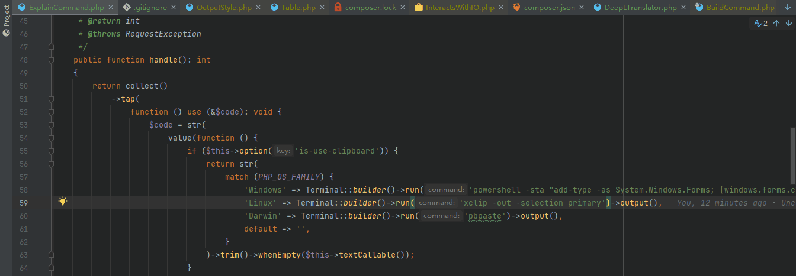

# code explain

What does it mean to explain the code（解释代码是什么意思）



# Requirements

* PHP >= 8.1

# Installation

## Composer

```bash
composer global require james.xue/code-explain
```

## 直接下载 [code-explain](./builds/code-explain) 可执行文件

```shell
curl 'https://mirror.ghproxy.com/https://raw.githubusercontent.com/xiaoxuan6/code-explain/main/builds/code-explain' -o code-explain --progress-bar
chmod +x code-explain
```

## Help

```bash
$ ./code-explain -h
Description:
  What does it mean to explain the code.

Usage:
  explain [options] [--] [<code>]

Arguments:
  code                    The code to explain

Options:
  -C, --is-use-clipboard  Use clipboard to get the code to explain
  -h, --help              Display help for the given command. When no command is given display help for the explain command
  -q, --quiet             Do not output any message
  -V, --version           Display this application version
      --ansi|--no-ansi    Force (or disable --no-ansi) ANSI output
  -n, --no-interaction    Do not ask any interactive question
      --env[=ENV]         The environment the command should run under
  -v|vv|vvv, --verbose    Increase the verbosity of messages: 1 for normal output, 2 for more verbose output and 3 for debug
```
